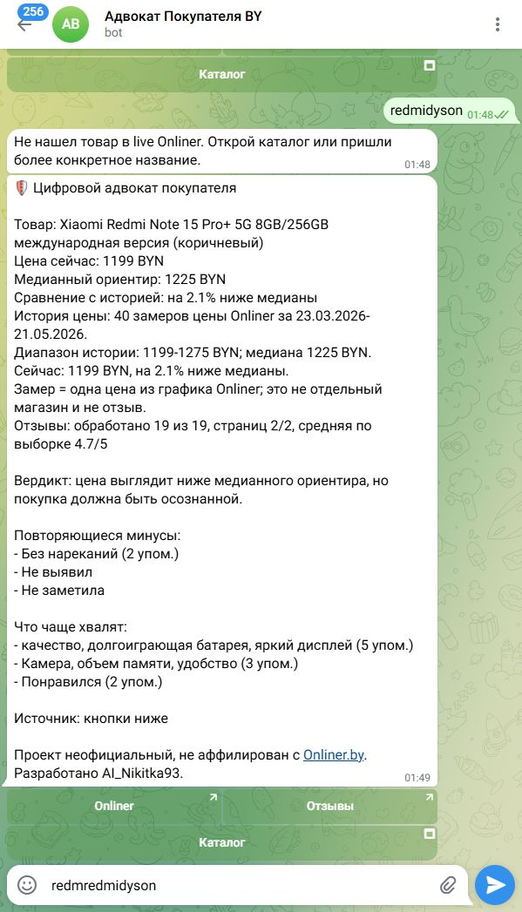
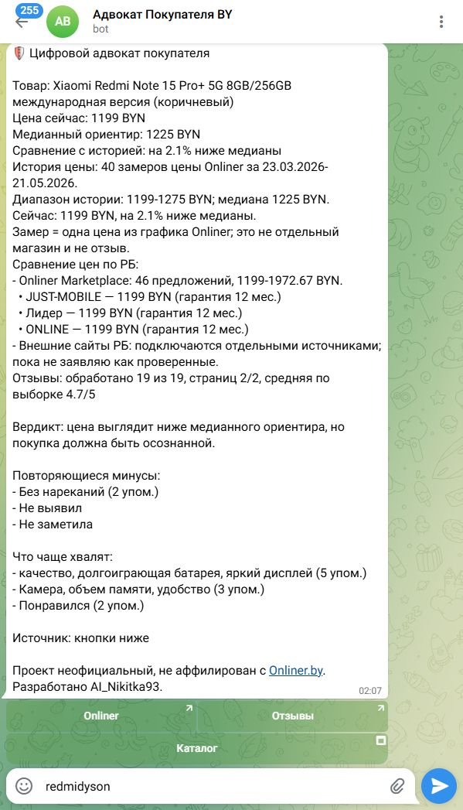
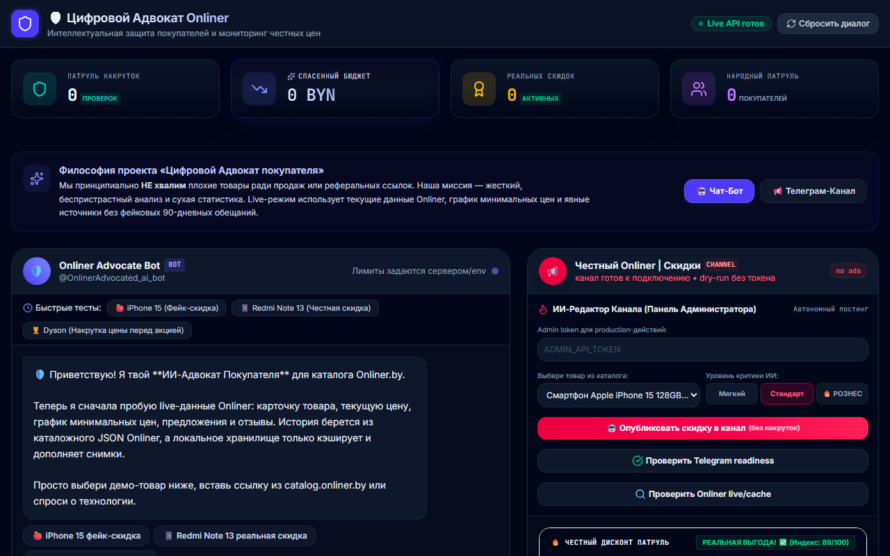
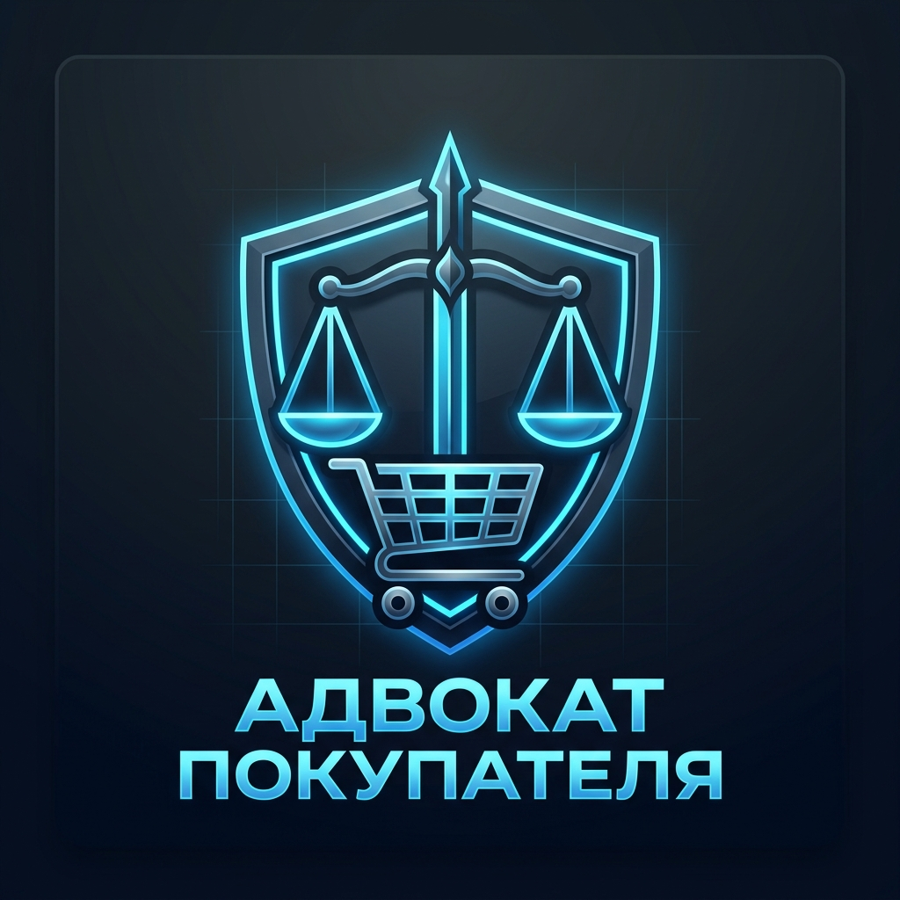

# ⚖️ Onliner Buyer Advocate Bot

**English** | [Русский](README.ru.md)

[](https://github.com/AI-Nikitka93/onliner-buyer-advocate-bot/actions/workflows/verify.yml)
[](LICENSE)
[](https://workers.cloudflare.com)
[](package.json)

An unofficial Telegram Bot and automated channel discount radar acting as a **"digital buyer advocate"** for Onliner.by.

Unlike standard discount scrapers, this bot exposes and strictly filters out **deceptive marketing markups** (such as artificial price hikes right before a sale) by analyzing the 12-month median price history of products.

---

## 🎯 Key Features

*   **Honest Discount Radar (Onliner Super-Prices):**
    *   Scans the catalog and calculates the actual price deviation relative to the historical median price.
    *   Filters out artificial or fake discounts (`isFakeDiscount`). If a seller claims a 70% discount but the current price is close to or higher than the 12-month median price, the deal is blocked.
*   **Flexible Publishing Policies:**
    *   **Price Constraints:** Filters out cheap/low-value items by default (minimum price threshold is set to `15 BYN` via `ONLINER_DEAL_MIN_PRICE_BYN`).
    *   **Bypass Price Limits for Deep Discounts:** Any genuine discount of **50% or higher** automatically bypasses the minimum price check (e.g., an item priced at 1 BYN with a 95% honest discount is published).
    *   **Minimum Offers Count:** Only considers deals with $\ge 2$ active sellers on Onliner to guarantee price competition.
*   **Cross-Store Price Comparisons:**
    *   Supports pilot price comparisons with the Belarusian retail chain **"5 element"** (`ENABLE_5ELEMENT_PILOT=true`) to cross-verify national pricing signals.
*   **Personal Price Watches:**
    *   Users can subscribe to real-time price drop notifications for specific items directly inside the Telegram Bot.
*   **Stale-Cache Fallback:**
    *   If the live Onliner catalog is temporarily unreachable, the bot serves the last cached snapshot labeled as a `fallback/stale cache` to avoid downtime.

---

## 🚀 Quick Start

### 💻 Local Run (Express + React)

To test the web app layout and debug bot conversation logic locally:

1.  **Install dependencies:**
    ```bash
    npm install
    ```
2.  **Setup Environment Variables:**
    Copy the example template and fill in your secrets:
    ```bash
    cp .env.example .env
    ```
3.  **Start Dev Server:**
    ```bash
    npm run dev
    ```
    Open in browser: [http://localhost:3000](http://localhost:3000)

---

## 🛡️ Cloudflare Workers Deployment

For a 24/7 free webhook and scheduled cron triggers, the bot compiles for and deploys to Cloudflare Workers.

### Useful Build & Deployment Commands:

```bash
# Simulates the Cloudflare Worker environment locally
npm run worker:dry-run

# Deploy code to Cloudflare Workers
npm run worker:deploy

# Run health diagnostics check on the deployed worker
npm run worker:doctor
```

> [!IMPORTANT]
> Cloudflare Worker secrets are set via the Wrangler CLI and must not be committed to Git:
> `wrangler secret put TELEGRAM_BOT_TOKEN`
> `wrangler secret put ADMIN_API_TOKEN`
> `wrangler secret put TELEGRAM_WEBHOOK_SECRET`

---

## 📊 Available API Endpoints

### Public / Client Endpoints:
*   `GET /app` — Entry point for the Telegram Mini App
*   `GET /api/health` — Service health status
*   `POST /telegram/webhook` — Telegram bot update receiver

### Administrative Endpoints (requires `ADMIN_API_TOKEN`):
*   `GET /api/telegram/doctor` — Diagnostics of bot configuration and channel admin permissions
*   `POST /api/telegram/set-webhook` — Configures the Telegram Bot webhook URL
*   `GET /api/channel/status` — Returns scheduled cron run logs and KV cache status
*   `POST /api/channel/publish-best-deals` — Manually triggers a catalog scan and publishes qualifying deals

---

## ⚙️ Scheduler Configuration (wrangler.toml / .env)

The bot behavior is customizable using the following environment variables:

| Variable | Default Value | Description |
| :--- | :---: | :--- |
| `ENABLE_TELEGRAM_DELIVERY` | `false` | Enables real message delivery to Telegram (otherwise acts as `dry-run`) |
| `ENABLE_CHANNEL_CRON` | `false` | Enables scheduled discount scans on Cloudflare (`0 */6 * * *`) |
| `MIN_HONEST_DISCOUNT_PERCENT` | `20` | Minimum honest discount percentage needed to qualify for the channel |
| `ONLINER_DEAL_MIN_PRICE_BYN` | `15` | Minimum price threshold in BYN for publishing deals |
| `ONLINER_DEAL_MIN_OFFERS` | `2` | Minimum active sellers count required on Onliner.by |
| `ENABLE_PRICE_WATCHES` | `true` | Enables real-time price monitoring registrations for users |

---

## 🧪 Testing and Verification

Run the local verification checks before committing changes:

```bash
# TypeScript compiler linting
npm run lint

# Compile production assets and bundle files
npm run build

# Run combined verify suite (compilation, maturity, and local smoke mock servers)
npm run verify:prod

# Verify structural compatibility with the live Onliner.by API contract
npm run contract:onliner:soft
```

---

## 📸 Screenshots & Design

### 🤖 Telegram Bot Interface
The bot delivers clear value signals by exposing artificial price markups, displaying price dynamics, and providing summarized user reviews:

<p align="center">
  
  
</p>

### 🖥️ Local Web Dashboard
A sleek, glassmorphic dark-theme dashboard designed for local runs, diagnostic controls, and test triggers:

<p align="center">
  
</p>

### 🎨 Branding / Avatars
Premium identity assets created for the bot and the channel:

<p align="center">
  
  
</p>

---

## 🤝 Contributing

We welcome all contributions to this project! Please read our community guidelines before submitting a pull request:
*   Commit rules and Git trailers format: [CONTRIBUTING.md](.github/CONTRIBUTING.md)
*   Security disclosures and reporting policy: [SECURITY.md](.github/SECURITY.md)
*   Community standards: [CODE_OF_CONDUCT.md](.github/CODE_OF_CONDUCT.md)

---

## ⚖️ License

This project is licensed under the **MIT License**. For details, please see the [LICENSE](LICENSE) file.
